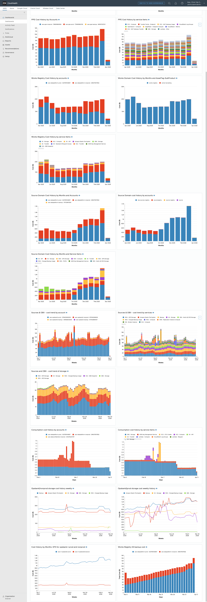
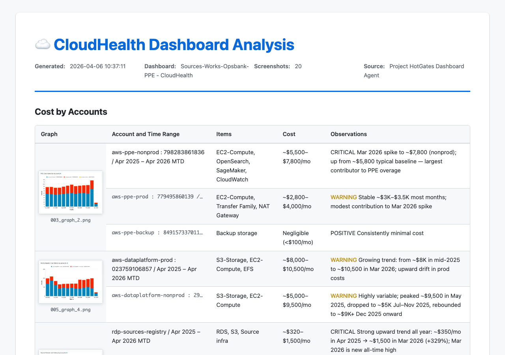

# AutoCrossSystemLogins (Project HotGates)

Browser automation CLI that logs into multiple internal dashboards (Tableau, SharePoint, JIRA, Azure, CloudHealth) in a single persistent Chromium session using SSO/token-based authentication.

## Quick Start

### 1. Install

```bash
./setup.sh
```

This creates a `.venv`, installs all dependencies, downloads the Playwright-managed Chromium binary, and copies `.env.example` → `.env`.

### 2. Configure credentials

Edit `dashboard-agent/.env`:

```env
SSO_USERNAME=<username>@domain.net
SSO_PASSWORD=<password>
TABLEAU_EMAIL=<email>
ATLASSIAN_EMAIL=<email>
ATLASSIAN_API_TOKEN=<api_token>
CLOUDHEALTH_EMAIL=<email>       # optional
CLOUDZERO_EMAIL=<email>         # optional
```

Generate an Atlassian API token at https://id.atlassian.com/manage-profile/security/api-tokens.

### 3. Configure dashboards

```bash
cp dashboard-agent/config/dashboards.yaml.example dashboard-agent/config/dashboards.yaml
```

Edit `dashboard-agent/config/dashboards.yaml` and replace the `<placeholder>` values with your actual dashboard URLs:

```yaml
dashboards:
  - id: tableau-dashboard
    name: "My Dashboard Group"
    auth_type: email_only
    urls:
      - name: "View 1"
        url: "https://<tableau-region>.online.tableau.com/#/site/<site>/views/..."
      - name: "View 2"
        url: "https://<tableau-region>.online.tableau.com/#/site/<site>/views/..."

  - id: cloudhealth-dashboard
    name: "CloudHealth"
    auth_type: cloudhealth
    url: "https://apps.cloudhealthtech.com/dashboard/<dashboard-id>"

  # ... etc
```

Each entry requires:
- `id` — unique identifier (used internally)
- `name` — display name shown in logs
- `auth_type` — one of `email_only`, `sso`, `aipro`, `powerbi`, `smartsheet`, `cloudhealth`, `cloudzero`, `atlassian`
- `url` (single) or `urls` (list of `name`/`url` pairs)

`dashboards.yaml` is gitignored — it is never committed. `dashboards.yaml.example` is the committed template.

### 4. First run (one-time manual setup)

```bash
source .venv/bin/activate
python run.py
```

The browser opens and prompts you to complete each SSO login manually once. Press ENTER in the terminal after each step. A `.setup_complete` marker is saved — all future runs are fully automated.

To redo first-run setup:

```bash
rm -rf dashboard-agent/.auth_session/
python run.py
```

## Usage

```bash
source .venv/bin/activate

python run.py                                      # Open all dashboards
python run.py --list                               # List available dashboard groups
python run.py <id-or-name> [<id-or-name> ...]      # Open matching dashboard groups only
python run.py cloudhealth-report                   # Generate CloudHealth cost report
python run.py cloudhealth-report "cost by service" # Report with a focus area
```

### Open all dashboards

Launches a maximized Chromium window, authenticates (or skips if session is still valid), and opens every configured dashboard as a tab. The script exits and the browser stays open.

### Open specific dashboards

Pass one or more group IDs or name fragments to open only matching dashboards:

```bash
python run.py atlassian                  # open the Atlassian group
python run.py ops-metrics finance        # open two groups by ID
```

Run `python run.py --list` to see all available group IDs and names.

### CloudHealth report

Requires the orchestrator browser session to already be running (`python run.py`) and the GitHub Copilot CLI to be installed:

```bash
gh extension install github/gh-copilot
```

The report workflow:
1. Captures full-page screenshots of CloudHealth dashboards
2. Invokes `copilot -p` to analyze cost trends and anomalies
3. Generates a timestamped HTML report in `dashboard-agent/output/`
4. Opens the report in a new browser tab

#### Example

**Input — dashboard screenshot**: The agent captures the full CloudHealth page as a series of overlapping tile screenshots, producing a composite that covers all chart panels in the session — typically ~19 stacked bar and line charts showing cost history by accounts and by service items across multiple AWS environments (PPE, Works Registry, Source Domain, OpsBank2, Consumption).



**Output — generated report**: A timestamped HTML page (`cloudhealth_report_<timestamp>.html`) with three structured sections:



- **Cost by Accounts** — per-account cost table showing graph thumbnail, account ID, time range, top services, monthly/weekly cost range, and an observations cell with color-coded severity badges (`CRITICAL` / `WARNING` / `POSITIVE`).
- **Cost by Service** — per-domain breakdown listing the top cost drivers, dollar ranges, and trend observations (e.g., "EC2 - Compute: ~$2,500–$3,500/mo (largest, ~30% of total)").
- **Executive Summary** — findings table with ~10 rows covering total run rate, top cost drivers, anomalies, and 6-month trends, followed by three tiers of prioritized action items: *Immediate (this week)*, *Short-term (next 30 days)*, and *Medium-term (next quarter)*.

All graph thumbnails are clickable — clicking opens a full-size lightbox overlay.

## Prerequisites

- Python 3.11+
- Chromium — installed automatically by `setup.sh` via `playwright install chromium`
- GitHub Copilot CLI — required only for `python run.py cloudhealth-report`

## Project Layout

```
run.py                        # Entry point
setup.sh                      # One-time bootstrap
dashboard-agent/
  .env                        # Credentials (not committed)
  config/
    dashboards.yaml           # Dashboard registry (add/remove URLs here)
    prompts.yaml              # CloudHealth analysis prompts
    report_template.html      # HTML report template
  src/
    orchestrator.py           # Browser launch, auth, tab management
    cloudhealth_report.py     # CloudHealth report orchestrator
    auth/                     # Auth strategies per service
    config/loader.py          # Credential loader
  output/                     # Generated HTML reports
  tests/                      # pytest suite
  README.md                   # Full architecture and design details
```

See [dashboard-agent/README.md](dashboard-agent/README.md) for full architecture, auth strategy details, and configuration options.
